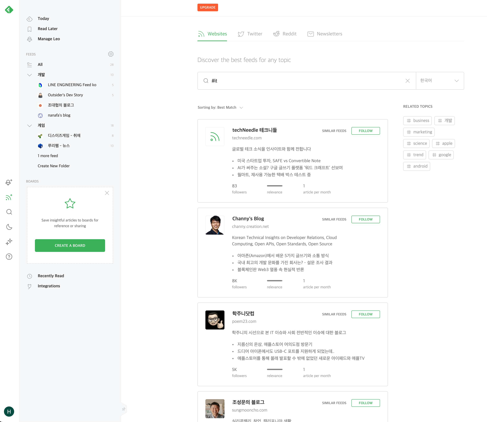
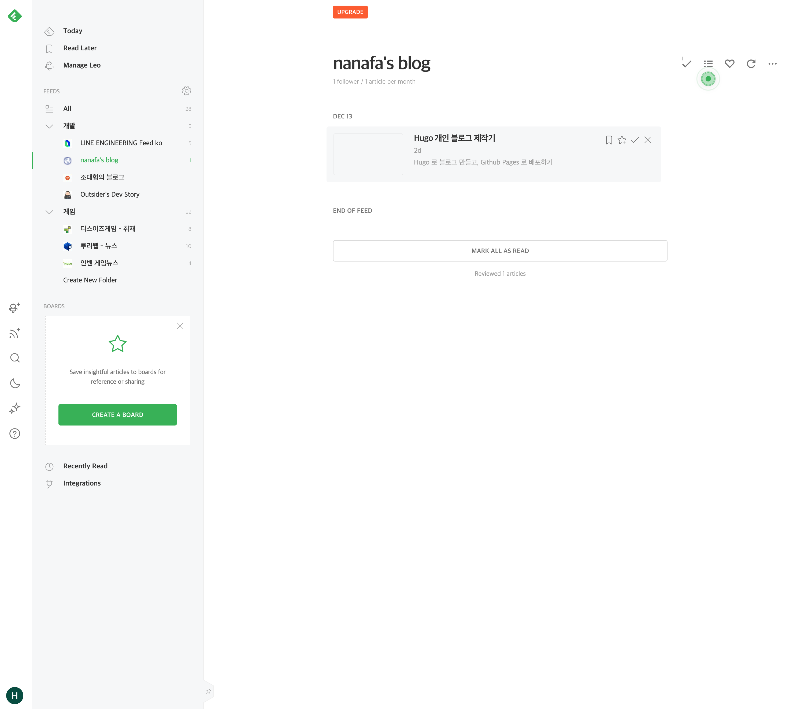

## 블로그를 만들고 보니..

블로그를 만들고 보니, 현재 내 블로그는 검색엔진을 통해서만 노출될 수 있다는 사실이 불편했다.

그럼 블로그를 홍보 및 서비스 할 수 있는 서비스는 어떤게 있을까? 이번 글에서는 이러한 서비스 찾아보고 분석해본 경험을 공유해보고자 한다.

## memo

- 현재 블로그에 글을 쓴다는게 어떤 의미인지 써보자
- 블로그는 정말 컨텐츠의 보고라고 생각된다. 하지만 지금 이런 쩌리 취급받는것에 대해서 분석해보자
- geeknews 같은 뉴스레터는 꽤 의미있음
- feedly 같은 서비스 분석
- 그외
  - substack 은 왜 배제했는지
  - flipboard 는 왜 배제했는지
- 결론
  - 블로그가 생각보다 제대로된 대접을 못받고 있다고 생각된다. 물론, 한편당 기대 가격이 터무니 없이 낮다는것을 생각해 보면, 돈을 기대할 수 있는 시장은 아닐꺼 같다. 하지만 관심있는 한두명이 있으면 만들어 봄직한 서비스이기도 하다.

## memo

- 티스토리 품앗이 / 맞구독
- 블로그를 좀더 잘 홍보 할 수 있는 사이트
- 개인 블로그로 어떤 일들을 할 수 있을까?
- 뉴스레터?
- RSS?
- 한편에 가격은 터무니 없이 낮을것 같다. 정말 질좋은 내용이 아니라면.. 때문에 편당 가격이나 구독을 원하는 서비스는 정말 특별함을 제공해주지 않으면 쉽지 않다.
- 놀랍게도 블로그를 노출시킬 수 있는 방법이 없다.
  - 전부다 알고리즘 선택을 받으라는 말 뿐...

## 분석하려고 하는것

- 대체제
- 잠재적 진입자
- 기존 경쟁자
- 수요자

### newsletter?

### feedly 분석

이게 최고

<!-- substack 은 안되는게 좀 있어서 일단 훨씬 좋다고 생각하는 feedly 만 자세히 파보자 -->

 
